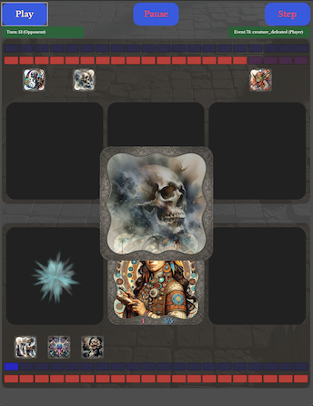

# Concentric (Godot Version)

This document describes the technical design and current implementation of "Concentric" in Godot. Concentric is a turn-based Player vs. Environment (PvE) deck-building auto-battler. The game was written by Piato at `duel.neocities.org/concentric/`, this version is being built by Niall C (in discussion with Piato).

The core gameplay involves the player building a small deck of cards for automated battles against computer adversaries. Battle outcomes are determined by the game's logic, and then visually replayed to the player. We imagine development so that winning battles yields rewards, such as new cards, allowing the player to further refine their deck and progress (but none of this is implemented yet).

The current primary focus is on the robust **battle simulation logic** and the **visual battle replay system**. While these core components are largely functional, development is ongoing to expand features and refine the overall game.

## Current Status
* In active development.
* Core battle simulation engine implemented.
* Event-driven battle replay system with basic visuals for key game actions (card plays, summons, attacks, damage, mana/HP changes, etc.) is functional. Battles are generally followable, though some complex card effect displays (e.g., Coffin Traders) are pending refinement.
* A library of over 50 cards with unique effects is implemented.
* The project is evolving beyond a direct re-implementation towards a standalone game, with plans for broader features.

## Technology Stack
* **Engine:** Godot Engine 4.x (currently v4.4.1, targeting general 4.x compatibility)
* **Language:** GDScript
* **Testing:** GUT (Godot Unit Test) for core logic.

## Getting Started

### Prerequisites
* Godot Engine 4.x installed.

### Running the Project
1.  Clone this repository.
    *(Repository URL: `https://github.com/niallc/ConcentricGodot_Apr25` or your fork's URL).*
2.  Open the project in the Godot Engine editor.
3.  To see a sample battle replay, run the scene: `scenes/placeholder_root_node_2d.tscn`. This scene is set up to demonstrate the replay system with a predefined battle.

### Important Note on Art Assets
* The game logic and card data (`.tres` files) reference card artwork and other visual assets using `res://art/...` paths (e.g., `res://art/cards/my_card.webp`).
* **These art assets are not currently included in this Git repository** to keep the repository lightweight.
* **Consequence:** If you clone this repository and run the project without the art assets, cards will likely appear with default placeholder art (if available and included in the repo) or might cause errors if the game attempts to load missing `res://` paths.
* **For Development:** If you are interested in developing or contributing to this project and require the full art assets, please contact Niall C at `niallc+concentric@gmail.com` to discuss obtaining them and the correct local setup.

## For Developers

This project uses a detailed technical specification to guide development and maintain consistency. If you're interested in understanding the architecture, event system, core logic, or card effect implementation patterns, please refer to:

* **[SPECIFICATION.md](SPECIFICATION.md)**

The primary areas of code are:
* **Core Battle Logic:** `res://logic/` (includes `Battle.gd`, `Combatant.gd`, `SummonInstance.gd`, `CardInZone.gd`)
* **Card Definitions & Effects:** `res://data/cards/instances/` (for `.tres` files), `res://logic/card_effects/` (for `.gd` effect scripts), and `res://data/cards/card_data.json` (source data).
* **Battle Replay System:** `res://scenes/battle_replay_scene.tscn` and its script `res://scenes/battle_replay.gd`.
* **UI Components for Replay:** `res://ui/` (e.g., `SummonVisual.tscn`, `CardIconVisual.tscn`).

## Contributing
This project is, in theory, open to contributions. If you are interested in contributing, it's probably easiest to reach out to Niall C at `niallc+concentric@gmail.com` first, and I'd like to get the email anyway.

## Future Ideas
While the current focus is on the battle and replay systems, envisioned future developments include:
* Maze navigation system.
* Persistent player progression and deckbuilding between battles.
* A wider variety of adversaries and challenges.
* User interface for deck management and game setup.

## License
This project is licensed under the MIT License. Please see the `LICENSE` file (which you should create in the root of the repository) for full details.

In the unlikely vent of parties interested in commercial applications of this work or its derivatives, please reach out to discuss with Piato and Niall C.

---